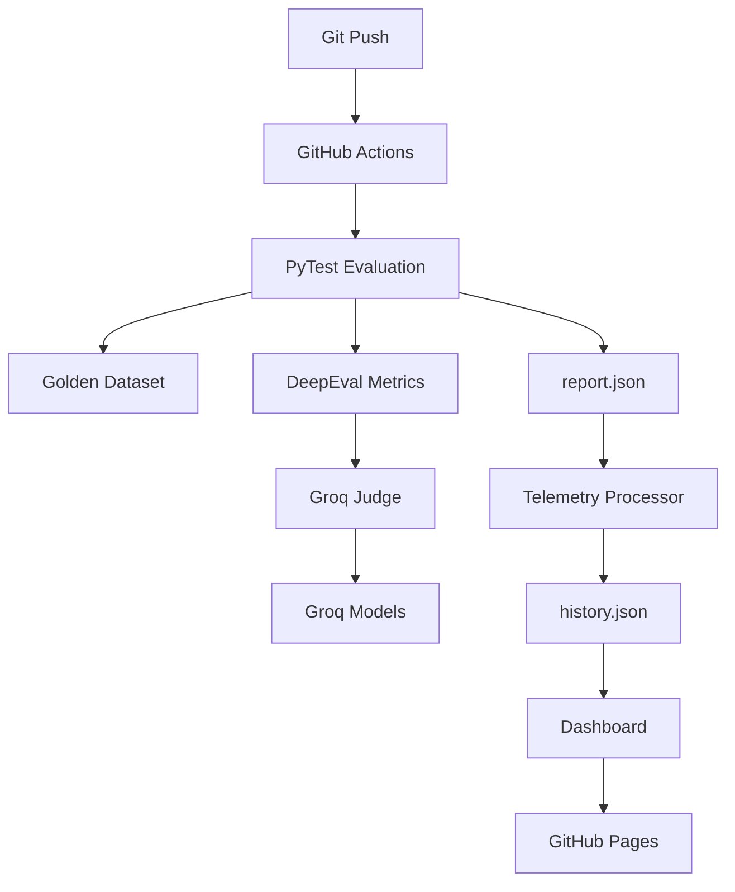

# llm-eval-cicd

> A zero-cost CI/CD evaluation pipeline for LLM applications using Groq, DeepEval, GitHub Actions, and GitHub Pages.


---

## Overview

`llm-eval-cicd` is a fully automated evaluation pipeline for Large Language Model applications.

The project continuously validates LLM responses against a golden dataset using DeepEval metrics and Groq-hosted models, then tracks performance over time through a dashboard automatically deployed via GitHub Pages.

The entire stack runs on free-tier infrastructure.

### What It Solves

* Detects hallucinations before deployment
* Measures answer relevancy and faithfulness
* Tracks model quality over time
* Monitors latency regressions
* Provides automated CI/CD validation for LLM systems

---

## Features

### Automated LLM Evaluation

* DeepEval-powered testing
* Hallucination detection
* Answer relevancy scoring
* Faithfulness validation
* Golden dataset regression testing

### Custom Groq Judge

* Native Groq integration
* Schema-aware evaluation pipeline
* Supports:

  * `llama-3.1-8b-instant`
  * `llama-3.3-70b-versatile`

### Telemetry & Analytics

* Pass rate tracking
* P50 latency monitoring
* P95 latency monitoring
* Historical performance storage
* Cost visibility

### CI/CD Automation

* Triggered on every push
* GitHub Actions workflow
* Automated report generation
* Historical metric persistence

### Dashboard

* GitHub Pages deployment
* Interactive charts
* Dark mode interface
* Historical trend analysis

---

## Architecture



---

## Repository Structure

```text
.
├── tests/
│   ├── dataset.json
│   └── test_llm.py
│
├── scripts/
│   ├── generate_dataset.py
│   └── process_metrics.py
│
├── history.json
├── report.json
├── index.html
│
└── .github/
    └── workflows/
        └── eval.yml
```

| File                          | Purpose                |
| ----------------------------- | ---------------------- |
| `tests/test_llm.py`           | Main evaluation runner |
| `tests/dataset.json`          | Golden dataset         |
| `scripts/generate_dataset.py` | Dataset generation     |
| `scripts/process_metrics.py`  | Telemetry aggregation  |
| `history.json`                | Historical metrics     |
| `index.html`                  | Dashboard              |
| `.github/workflows/eval.yml`  | CI/CD pipeline         |

---

## Technology Stack

| Layer      | Technology                   |
| ---------- | ---------------------------- |
| Language   | Python 3.10+                 |
| Testing    | PyTest                       |
| Evaluation | DeepEval                     |
| Inference  | Groq                         |
| Models     | Llama 3.1, Llama 3.3         |
| Reporting  | pytest-json-report           |
| Dashboard  | HTML, Tailwind CSS, Chart.js |
| CI/CD      | GitHub Actions               |
| Hosting    | GitHub Pages                 |

---

## Installation

### Clone Repository

```bash
git clone https://github.com/yourusername/llm-eval-cicd.git

cd llm-eval-cicd
```

### Create Virtual Environment

```bash
python -m venv .venv

source .venv/bin/activate
```

### Install Dependencies

```bash
pip install --upgrade pip

pip install deepeval groq pytest pytest-json-report
```

---

## Environment Variables

Create a `.env` file or export your API key:

```bash
export GROQ_API_KEY="your_api_key"
```

| Variable       | Description           |
| -------------- | --------------------- |
| `GROQ_API_KEY` | Groq API access token |

---

## Generate Evaluation Dataset

Generate or refresh the 100-case golden dataset:

```bash
python scripts/generate_dataset.py
```

---

## Run Evaluation Pipeline

Execute all evaluation tests:

```bash
pytest tests/test_llm.py \
  --json-report \
  --json-report-file=report.json
```

---

## Process Telemetry

Convert raw test output into dashboard-ready metrics:

```bash
python scripts/process_metrics.py
```

Example:

```text
📊 PIPELINE TELEMETRY SUMMARY

✅ Pass Rate:      9.0%
⏱️ P50 Latency:    47.255s
⚡ P95 Latency:    48.957s
💳 Estimated Cost: $0.00

```

---

## CI/CD Workflow

Every push to `main` automatically:

1. Installs dependencies
2. Executes evaluation suite
3. Generates telemetry reports
4. Updates historical metrics
5. Deploys dashboard updates

Workflow location:

```text
.github/workflows/eval.yml
```

---

## Dashboard

The dashboard visualizes:

* Pass Rate Trends
* Latency Trends
* Evaluation History
* Pipeline Health

Add a screenshot:

```markdown

```

---

## Future Improvements

* Multi-model benchmarking
* RAG-specific evaluation suites
* Drift detection alerts
* Slack notifications
* Cost tracking per run
* OpenTelemetry integration
* Experiment comparison views

---

## License

MIT License

See `LICENSE` for details.
